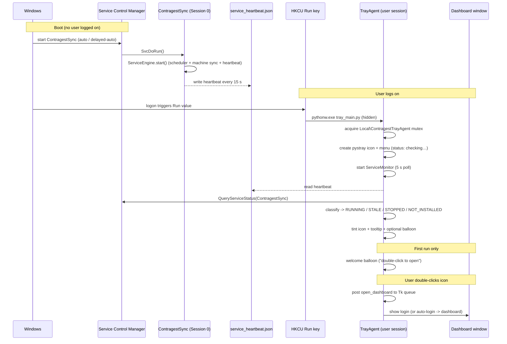
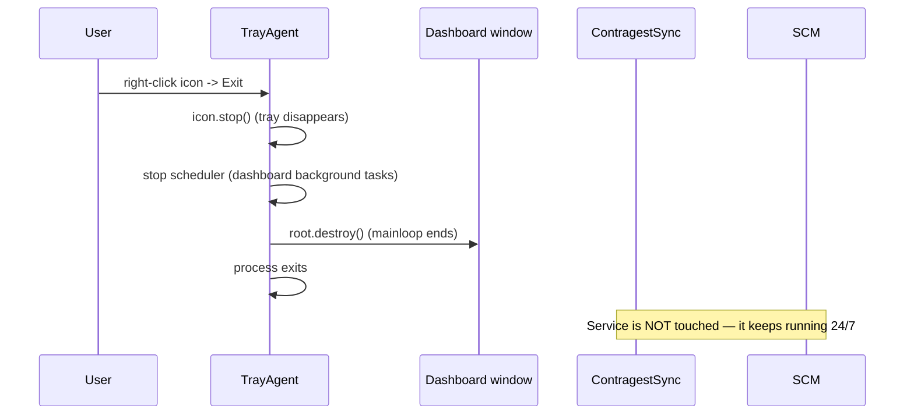
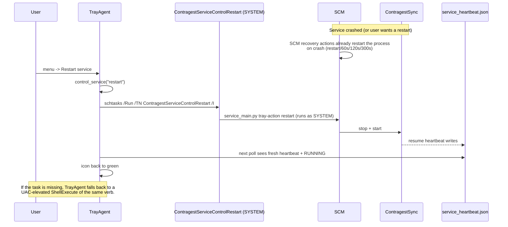

# Contragest System Tray Agent

Production guide for the tray agent that keeps the desktop app alive in the
system tray, gives live visibility into the `ContragestSync` Windows service,
and lets users start/stop/restart that service from the tray — without a UAC
prompt.

Companion to [windows_service.md](windows_service.md): the **service** keeps the
headless engine running 24/7 at boot; the **tray agent** is the interactive
front-door in the logged-on user session.

---

## 1. Architecture

```
┌─ Session 0 (no desktop) ───────────────────────────────────────────────────┐
│                                                                            │
│  ContragestSync service  (scripts/install_service.ps1)                     │
│  ├─ ServiceEngine: scheduler, machine sync, heartbeat, Event Log           │
│  └─ writes logs/service_heartbeat.json every 15 s  (+ optional HTTP /health)│
│                                                                            │
└────────────────────────────────────────────────────────────────────────────┘
        ▲                              ▲                        ▲
        │ reads heartbeat JSON         │ SCM query              │ schtasks /Run
        │ (logs/service_heartbeat.json)│ (read-only, no rights) │ (SYSTEM tasks)
┌───────┴──────────────────────────────┴────────────────────────┴────────────┐
│  Interactive user session (Session 1+)                                     │
│                                                                            │
│  ContragestTray.exe / pythonw tray_main.py  (scripts/install_tray.ps1)     │
│  ├─ [Tk main thread] window + mainloop                                     │
│  │     ├─ ServiceMonitor.poll_once()  every 5 s                           │
│  │     └─ drains command queue from the tray thread                        │
│  ├─ [pystray thread] tray icon + menu (Open/Start/Stop/Restart/Settings/  │
│  │   Exit) and balloon notifications                                       │
│  └─ single-instance mutex: Local\ContragestTrayAgent (per session)         │
│                                                                            │
│  SYSTEM scheduled tasks (created by install_tray.ps1):                     │
│  ├─ ContragestServiceControlStart    -> service_main.py tray-action start  │
│  ├─ ContragestServiceControlStop     -> service_main.py tray-action stop   │
│  └─ ContragestServiceControlRestart  -> service_main.py tray-action restart│
└────────────────────────────────────────────────────────────────────────────┘
```

### Components

| Component | Where | Role |
|-----------|-------|------|
| **Foreground UI** | `main.py` / `tray_main.py` + `contragest/features/*` | Tkinter/ttkbootstrap desktop app: login, dashboard, reports. |
| **Tray agent** | `contragest/tray/` + `tray_main.py` | Tray icon, menu, notifications, hide-to-tray semantics, service monitoring and control. |
| **Background service** | `contragest/win_service.py` + `service_engine.py` | Headless 24/7 engine under the SCM (unchanged by this work). |
| **IPC** | heartbeat file, SCM API, scheduled tasks | Agent **reads** status; agent **controls** via SYSTEM tasks. |

### Session model (user-session vs service context)

* **Boot → no user logged in.** `ContragestSync` starts under the SCM in
  Session 0. Attendance data keeps flowing, alerts/audits run. There is **no
  tray icon** (Windows has no tray in Session 0) — by design.
* **User logon.** The HKCU `Run` key launches the tray agent with
  `pythonw.exe` (no console). The tray icon appears next to the clock; the
  dashboard stays closed until the user opens it. Each logged-on session runs
  its **own** agent (session-scoped mutex).
* **Logoff.** The agent exits with the session; the service keeps running.

### New files (this feature)

| File | Purpose |
|------|---------|
| `tray_main.py` | Tray-enabled launcher (replaces `main.py` in production). |
| `contragest/tray/__init__.py` | Package metadata. |
| `contragest/tray/paths.py` | Heartbeat / config / deployment-dir resolution. |
| `contragest/tray/settings.py` | Per-user preferences (`%APPDATA%\Contragest\tray_config.json`). |
| `contragest/tray/service_state.py` | Pure SCM+heartbeat → status classification (testable). |
| `contragest/tray/service_control.py` | SCM queries + elevated control (tasks, UAC fallback). |
| `contragest/tray/service_monitor.py` | 5 s polling monitor, status-change events. |
| `contragest/tray/icons.py` | Runtime-generated status-tinted tray icons (Pillow). |
| `contragest/tray/agent.py` | `TrayAgent`: pystray icon, menu, Tk bridge, settings dialog. |
| `scripts/install_tray.ps1` / `uninstall_tray.ps1` | Installer / uninstaller. |
| `requirements-tray.txt` | `pystray`, `pillow`, `pywin32`, `pyinstaller`. |
| `packaging/contragest-tray.spec` | PyInstaller onedir windowed build. |
| `test_tray_agent.py` | 40 unit tests (pure logic + mocked monitor). |

---

## 2. Sequence diagrams

### 2.1 Startup



### 2.2 Shutdown (user exits)



### 2.3 Restart service from the tray (crash recovery)



### 2.4 Crash recovery — who does what

| Layer | Mechanism | Scope | Automatic? |
|-------|-----------|-------|-----------|
| Service engine | `_scheduler_watchdog_loop` restarts a dead scheduler thread | In-process | Yes |
| SCM | `sc.exe failure … actions= restart/60000/…` (set at install) | Process crash/hang | Yes |
| Tray agent | poll notices `STALE`/`STOPPED`, icon red/amber + balloon | User visibility | Yes |
| User | one click: `Restart service` from the tray | Fastest human recovery | No |
| Agent restart | HKCU Run key relaunches agent at next logon | Agent crash | At logon |

---

## 3. UX behaviour

* **Minimize** → hidden to the tray (default; toggle in Settings).
* **Close (X)** → hidden to the tray (default; toggle in Settings); only the
  tray **Exit** menu fully quits the app.
* First hide shows a one-time balloon: *"Contragest is still running in the
  tray."*
* **Double-click** the icon (or *Open Contragest*) restores the window
  maximized (or back to the login screen).
* **Tooltip** always shows the live service state, e.g.
  `Contragest — Service: Running`.
* **Context menu**:
  * `Open Contragest` (default / double-click)
  * `Service: <state>` (read-only status line)
  * `Start service` / `Stop service` / `Restart service`
    (auto-disabled when not applicable)
  * `Settings…` (minimize-to-tray, close-to-tray, notifications)
  * `Exit`
* **Icon visual states** (status dot on the logo):

  | Status | Icon | Meaning |
  |--------|------|---------|
  | `Running` | green | SCM RUNNING + heartbeat fresh |
  | `Running but unresponsive` | amber | SCM RUNNING but heartbeat stale (engine hung) |
  | `Starting…` / `Stopping…` / `Paused` | amber | transitional |
  | `Stopped` | red | service cleanly stopped |
  | `Service not installed` | red | no `ContragestSync` service registered |
  | `Unknown` | gray | first ticks before any probe |

* **Balloon notifications** (Settings toggle) fire only on meaningful
  transitions: service went down (`stopped` / `stale` / `not installed`) and
  service recovered (`→ running`). No spam on the first probe.
* **Accessibility**: the menu labels are plain text; the tooltip carries the
  same information as the icon colour, so colour-blind users are not left
  guessing.

---

## 4. Reliability & monitoring

* **Heartbeat file** is the source of truth for engine health
  (`logs/service_heartbeat.json`, written every 15 s). The agent flags the
  engine as `stale` after `heartbeat_max_age_seconds` (default 45 s = 3 missed
  beats).
* **SCM state** is the source of truth for *installed/running*; a transient
  SCM query failure falls back to the heartbeat so a one-off hiccup never
  flashes red.
* **Self-healing**: the service already auto-restarts (SCM recovery + engine
  watchdog); the agent's job is to *surface* the problem and let the user
  trigger a restart with one click.
* **Logging**: the agent writes to `logs/contragest.log` through the existing
  rotating logger (`contragest/core/logging.py`, 5 MB × 5, multi-process
  safe).
* **Windows Event Log**: lifecycle events (`tray-action …`) from the elevated
  task land under source `ContragestSync`.
* **Update/upgrade**: replace the app folder and run
  `install_tray.ps1` (idempotent; updates Run key + tasks). The service is
  unaffected.
* **Agent crash**: relaunched at the next logon by the Run key. For
  mid-session restarts, `install_tray.ps1 -RestartAgent` stops and relaunches
  it.

---

## 5. Permissions, security & session contexts

* **Read-only**: the agent queries SCM state and reads the heartbeat file from
  the interactive session — no elevation needed.
* **Control**: never performed by the agent itself. All start/stop/restart
  goes through SYSTEM scheduled tasks registered at install time, so there is
  **no UAC prompt** at runtime and no password is stored anywhere.
* **Fallback**: if the tasks are missing (agent copied to another machine), the
  agent falls back to a UAC-elevated `ShellExecute("runas")` — one consent
  dialog per action.
* **Deploy service + tray from the same folder** (or set
  `CONTRAGEST_BASE_DIR`) so the agent finds the service's heartbeat file.
* **Multi-user machines**: the mutex is session-scoped
  (`Local\ContragestTrayAgent`), so Fast User Switching gives each user their
  own tray icon; the service and DB are shared.
* **Least privilege**: the Run key runs as the logged-on user; the SYSTEM
  tasks run `service_main.py tray-action …` with no secrets.

---

## 6. Packaging & deployment

### 6.1 Prerequisites

* The `ContragestSync` service must be installed first:
  `scripts\install_service.ps1` (see `docs/windows_service.md`).
* Python 3.10–3.14 venv at `$AppDir\.venv` (or pass `-VenvPython`).

### 6.2 Install (one command, as Administrator)

```powershell
powershell -ExecutionPolicy Bypass -File .\scripts\install_tray.ps1 -RestartAgent
```

This:
1. Installs `requirements-tray.txt` (pystray, pillow, pywin32).
2. Creates `ContragestServiceControl{Start,Stop,Restart}` SYSTEM tasks.
3. Registers the HKCU Run key `ContragestTray` →
   `"…\.venv\Scripts\pythonw.exe" "…\tray_main.py"`.
4. Launches the agent (shows the welcome balloon).

Registry key written (per-user):

```
HKCU\Software\Microsoft\Windows\CurrentVersion\Run
    ContragestTray = "<pythonw.exe>" "<AppDir>\tray_main.py"
```

### 6.3 Build a frozen tray exe (optional)

```powershell
powershell -ExecutionPolicy Bypass -File .\scripts\build_service.ps1   # service exe, existing
& .\.venv\Scripts\python.exe -m PyInstaller packaging\contragest-tray.spec --noconfirm
# -> dist\ContragestTray\ContragestTray.exe  (windowed onedir)
```

Deploy `dist\ContragestTray` to the server **into the same folder as the
service** (so the heartbeat path resolves), then run `install_tray.ps1
-AppDir C:\Contragest\ContragestTray`.

### 6.4 MSI/group policy (alternative to the PowerShell installer)

The three system tasks and the Run key can also be authored as an MSI
(WiX `ServiceConfig` + `RegistryValue`) or pushed via GPO:

* Scheduled tasks: configure `ContragestServiceControlStart/Stop/Restart` to
  run `<Python>\service_main.py tray-action start|stop|restart` as
  `NT AUTHORITY\SYSTEM` with *Run with highest privileges*, hidden, no
  trigger (manually run only).
* Autostart: a logon script setting the same `HKCU\…\Run` value, or a
  machine-wide `HKLM\…\Run` value if every user must get the tray.

### 6.5 Uninstall

```powershell
powershell -ExecutionPolicy Bypass -File .\scripts\uninstall_tray.ps1 -StopAgent
```

Removes the Run key, the three tasks, and optionally stops the agent. The
`ContragestSync` service is **not** touched.

---

## 7. Testing & acceptance criteria

### 7.1 Automated

```powershell
\.venv\Scripts\python.exe -m pytest test_tray_agent.py -v     # 40 tests
\.venv\Scripts\python.exe -m pytest test_service_engine.py -v # regression
```

### 7.2 Acceptance checklist

| # | Scenario | Expected |
|---|----------|----------|
| 1 | Fresh boot, nobody logged on | `sc.exe query ContragestSync` → `RUNNING`; heartbeat file age < 60 s; no tray icon (correct). |
| 2 | User logon after boot | Tray icon appears automatically; tooltip shows `Service: Running` (green dot) within ~5 s. |
| 3 | Double-click tray icon | Dashboard opens (or login screen); window maximizes. |
| 4 | Minimize the window | Window disappears from the taskbar; tray icon stays; balloon "still running in the tray" (first time only). |
| 5 | Close (X) the window | Same as minimize → tray; app process keeps running. |
| 6 | Tray → Exit | Tray icon disappears and the process exits; service **keeps running**. |
| 7 | Tray → Restart service | Icon turns amber, then green again within ~1 min; `Get-EventLog -Source ContragestSync` shows a `tray-action restart` event. No UAC prompt. |
| 8 | Tray → Stop service | Icon turns red; `sc.exe query` → `STOPPED`. |
| 9 | Tray → Start service | Icon turns green; `sc.exe query` → `RUNNING`. |
| 10 | Service stopped while agent runs | Balloon "not being collected"; icon red. |
| 11 | Service restarted externally | Balloon on recovery; icon green. |
| 12 | Engine hung (heartbeat stale) | Icon amber with `Running but unresponsive`. |
| 13 | `contragest.db` / share unreachable | Engine keeps retrying; agent shows `stale` only after the heartbeat ages out; SCM recovery restarts the process if needed. |
| 14 | Multi-user (fast user switch) | Each session gets its own tray agent; no mutex collision. |
| 15 | Permissions | Non-admin user can open the app, read status, and trigger service control **without** any UAC prompt. |
| 16 | Reinstall (update) | `install_tray.ps1` re-run is idempotent; Run key + tasks updated. |
| 17 | Uninstall | Run key and tasks gone; service untouched. |

---

## 8. Troubleshooting

| Symptom | Likely cause / fix |
|---------|--------------------|
| No tray icon at logon | Run key missing → re-run `install_tray.ps1`. Verify: `Get-ItemProperty HKCU:\Software\Microsoft\Windows\CurrentVersion\Run`. |
| Icon red / `Service not installed` | Service not installed, or agent deployed to a different folder than the service → `install_service.ps1`, and deploy agent next to the service (or set `CONTRAGEST_BASE_DIR`). |
| Icon amber `Running but unresponsive` | Engine wedged (stuck network call, share down). Use tray `Restart service`. Check `logs\contragest.log` + Event Log. |
| `Restart service` does nothing | SYSTEM tasks missing → re-run `install_tray.ps1`; verify `Get-ScheduledTask ContragestServiceControl*`. The agent falls back to UAC in this case. |
| UAC prompt appears for service actions | The SYSTEM tasks are missing (fallback path). Re-run the installer as admin. |
| Two tray icons for one user | A leftover instance from an older deploy — `install_tray.ps1 -RestartAgent` or kill processes running `tray_main.py`. |
| Balloon notifications not showing | Windows notification settings / focus assist; toggle `notify_on_change` in Settings. |
| Agent starts a console window | Run key must use `pythonw.exe`, not `python.exe`. |

---

## 9. Command cheat sheet

```powershell
# install / update the tray agent (admin)
powershell -ExecutionPolicy Bypass -File .\scripts\install_tray.ps1 -RestartAgent

# launch manually for testing (console visible)
\.venv\Scripts\python.exe tray_main.py --show

# verify
Get-ItemProperty HKCU:\Software\Microsoft\Windows\CurrentVersion\Run -Name ContragestTray
Get-ScheduledTask ContragestServiceControl*
Get-Content .\logs\contragest.log -Tail 20

# service still healthy?
\.venv\Scripts\python.exe service_main.py healthcheck

# remove the tray agent
powershell -ExecutionPolicy Bypass -File .\scripts\uninstall_tray.ps1 -StopAgent
```
